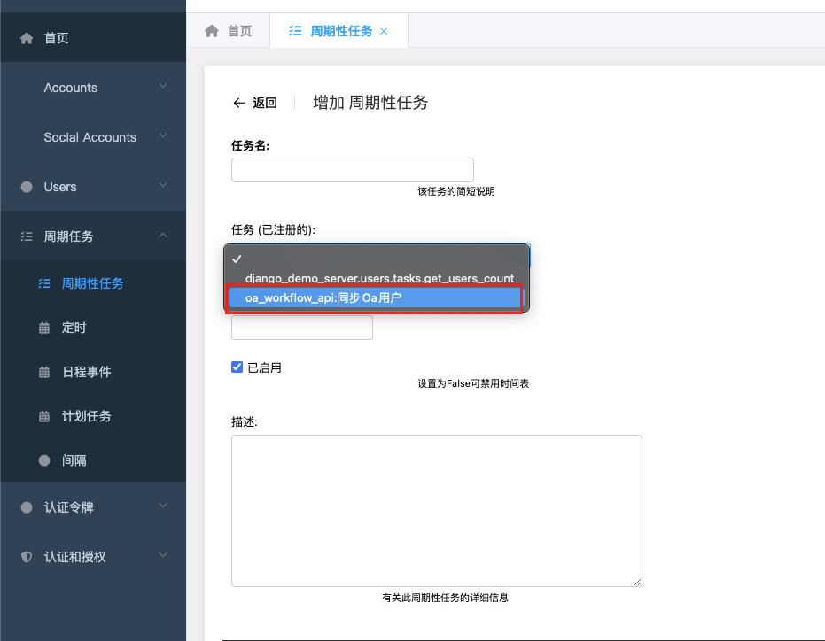

# oa-workflow-api


[](https://pypi.wochacha.cn/simple/oa-workflow-api/)
[](https://pypi.wochacha.cn/simple/oa-workflow-api/)
[](https://github.com/wccdev/oa-workflow-api/actions/workflows/dev.yml)
[](https://codecov.io/github/wccdev/oa-workflow-api)


Skeleton project created by Cookiecutter PyPackage


* Documentation: <https://wccdev.github.io/oa-workflow-api>
* GitHub: <https://github.com/wccdev/oa-workflow-api>
* PyPI: <https://pypi.wochacha.cn/simple/oa-workflow-api/>
* Free software: MIT


## Installation
- 使用 pip:
```bash
pip install oa-workflow-api

```
- 使用 poetry:
```bash
poetry add oa-workflow-api
```

## Usage
- 在 django setting中注册本应用 `'oa_workflow_api'`, 添加相关的配置
```python
INSTALLED_APPS = [
    "django.contrib.admin",
    ...,
    "django.contrib.auth",
    "xxxx.users",  # （项目指定AUTH_USER_MODEL的APP, 如果有）
    ...,
    "oa_workflow_api",
]

# 由oa提供
OA_WORKFLOW_API = {
    # oa接口应用id
    "APP_ID": "xxxx",
    # oa接口应用secret
    "APP_RAW_SECRET": "xxxx-xxx-xxxx",
    # oa接口应用spk
    "APP_SPK": "xxxxxxxxxx",
    # oa接口服务地址(域名)
    "OA_HOST": "https://oa.demo.com",

    # -----以下可选----- #
    # OA数据库连接信息
    "OA_DB_USER": "",
    "OA_DB_PASSWORD": "",
    "OA_DB_HOST": "",
    "OA_DB_PORT": 0,
    "OA_DB_SERVER_NAME": "",
    # OA数据库用户表信息（此处为默认值）
    "OA_DB_USER_TABLE": "ECOLOGY.HRMRESOURC",
    "OA_DB_USER_ID_COLUMN": "ID",
    "OA_DB_USER_STAFF_CODE_COLUMN": "LOGINID",
    "OA_DB_USER_DEPT_ID_COLUMN": "DEPARTMENTID",
    "OA_DB_USER_FETCH_COLUMNS": "ID, DEPARTMENTID",
    # requests包 Requests HTTP Library, 可使用自定义封装请求日志的requests代替
    "REQUESTS_LIBRARY": "requests",
}
```

### ~~1.全局使用~~(暂不推荐)
- 在 django setting中注册中间件 `'oa_workflow_api.middleware.OaWFRequestMiddleware'`:
```python
MIDDLEWARE = [
    ...,
    "django.contrib.auth.middleware.AuthenticationMiddleware",
    ...,
    "oa_workflow_api.middleware.OaWFRequestMiddleware",
]
```


### 2.局部使用
- 在需要使用的视图上继承
```python
from oa_workflow_api.mixin import OaWFApiViewMixin
from rest_framework.views import APIView


class YourViewSet(OaWFApiViewMixin, APIView):
    ...
```

#### 注意!!!
- 上述两种使用方法需要项目的`AUTH_USER_MODEL`提供属性`oa_user_id`

- `oa_user_id`为当前登入用户request.user在oa系统中对应的user_id
```python
from django.db.models import Model
class User(Model):
    ...

    class Meta:
        ...

    @property
    def oa_user_id(self):\
        # TODO 获取对应oa用户逻辑
        if hasattr(self, "oauserinfo"):
            return self.oauserinfo.user_id
        # 或者自定义逻辑
        oa_user_id = "1"
        return oa_user_id
```

- 完成上述步骤，即可在视图中使用
```python
from rest_framework.views import APIView
from rest_framework.response import Response
from rest_framework.decorators import action


# from oa_workflow_api.mixin import OaWFApiViewMixin
# class YourViewSet(OaWFApiViewMixin, APIView):  # 未注册中间件方式
class YourViewSet(APIView):
    @action(detail=False)
    def test(self, request, *args, **kwargs):
        workflow = request.oa_wf_api
        # 待办流程
        workflow.get_todo_list(page=1, page_size=10)
        # 已办流程
        workflow.get_handled_list(page=1, page_size=10)
        # 可创建流程
        workflow.get_create_list()
        # ...
        return Response()
```

### 3.使用类
```python
from oa_workflow_api.utils import OaWorkFlow

workflow = OaWorkFlow()
# 调用前必须使用register_user方法
# 注册需要调用流程接口的oa用户id
oa_user_id = "TODO"  # TODO
workflow.register_user(oa_user_id)

# 待办流程
workflow.get_todo_list(page=1, page_size=10)
# 已办流程
workflow.get_handled_list(page=1, page_size=10)
# 可创建流程
workflow.get_create_list()
# ...
```

### 4.使用现成接口 (TODO, 开发中)
```python
from django.urls import include, path

urlpatterns = [
    ...,
    path("api/", include("oa_workflow_api.urls"))
]
```

### 5.同步OA账号到当前项目
- 同步数据前需要在项目设置OA_WORKFLOW_API中配置AO数据库连接以及指定用户表信息
#### 5.1 设置保存数据的表
oa_workflow_api已经设置了相关表，可执直接执行迁移命令生成
详情请查看oa_workflow_api.models.OaUserInfo
```python
from django.contrib.auth import get_user_model
from django.db import models

UserModel = get_user_model()


class OaUserInfo(models.Model):
    user_id = models.IntegerField(unique=True, primary_key=True, verbose_name="OA用户数据ID")
    staff_code = models.OneToOneField(
        UserModel,
        on_delete=models.DO_NOTHING,
        to_field=UserModel.USERNAME_FIELD,
        db_column="staff_code",
        db_constraint=False,
        verbose_name="OA用户工号",
    )
    dept_id = models.IntegerField(null=True, verbose_name="OA用户部门ID")
```
```bash
python manage.py migrate oa_workflow_api

```

#### 5.2 在admin后台添加oa_workflow_api中的定时任务
需要celery以及django-celery-beat


#### 5.3 项目User获取同步到的oa用户信息
```python
from django.contrib.auth import get_user_model

user = get_user_model().objects.select_related("oauserinfo").first()
if hasattr(user, "oauserinfo"):
    print(user.oauserinfo.user_id)
    print(user.oauserinfo.staff_code)
    print(user.oauserinfo.staff_code_id)
    print(user.oauserinfo.dept_id)
```
